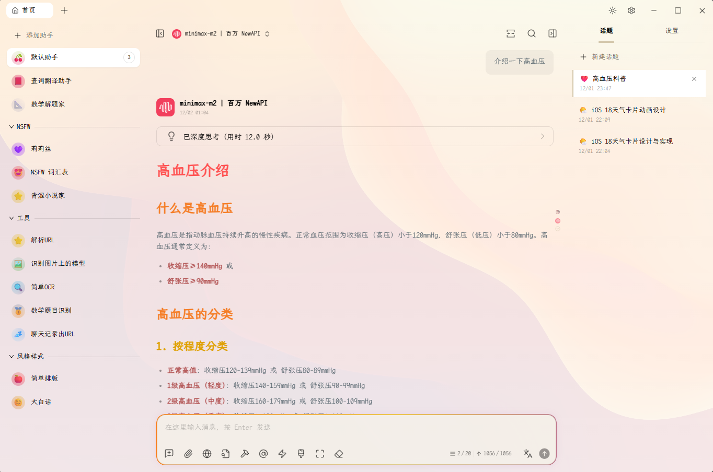

# Cherry Studio 美化

字体选用的 **霞鹜文楷屏幕阅读版等宽** 与 **Maple Mono**，先看看效果:




## 下载字体
- 霞鹜文楷屏幕阅读版：https://github.com/lxgw/LxgwWenKai-Screen/releases
- Maple Mono：https://font.subf.dev/zh-cn/download

下载字体文件 (.zip)，解压后将字体文件 (.ttf) 复制到系统字体目录 (Windows 为 `C:\Windows\Fonts`)。


## Cherry Studio 美化
Cherry Studio 显示设置里选择字体，如果没有显示字体，就重启 Cherry Studio/电脑。


最下面的`自定义 CSS`里粘贴以下 CSS 片段：

```CSS
:root {
  --light-background-image: url('https://gh-proxy.com/https://raw.githubusercontent.com/ZhuBaiwan-oOZZXX/HomePage/master/icons/background/wallpaper-light.png');
  --dark-background-image: url('https://gh-proxy.com/https://raw.githubusercontent.com/ZhuBaiwan-oOZZXX/HomePage/master/icons/background/wallpaper-dark.png');
}

body[theme-mode='light'] {
  --color-background: linear-gradient(rgba(255, 255, 255, 0.85), rgba(255, 255, 255, 0.9)), var(--light-background-image);
  --color-background-soft: #e8e4d8;
  --color-background-mute: #d8d4c8;
  --color-background-opacity: rgba(245, 242, 232, 0.7);
  --navbar-background-mac: transparent;
  --navbar-background: transparent;
  
  background-image: var(--color-background);
  background-size: cover;
  background-repeat: no-repeat;
  background-attachment: fixed;
}

body[theme-mode='dark'] {
  --color-background: linear-gradient(rgba(20, 20, 30, 0.75), rgba(20, 20, 30, 0.85)), var(--dark-background-image);
  --color-background-soft: #282832;
  --color-background-mute: #32323c;
  --color-background-opacity: rgba(30, 30, 40, 0.7);
  --navbar-background-mac: transparent;
  --navbar-background: transparent;

  background-image: var(--color-background);
  background-size: cover;
  background-repeat: no-repeat;
  background-attachment: fixed;
}


/* 代码块透明背景 */
div.shiki,
.markdown pre {
  background-color: rgba(0,0,0,0) !important;
}

div[class^="CodeHeader-"] {
  background-color: rgba(0,0,0,0);
}


/* https://github.com/BoningtonChen/CherryStudio_themes/blob/master/themes/just-flowing-border.css */

/* 优雅流彩动画 */
@keyframes elegantFlow {
    0% {
        background-position: 0 50%;
    }
    50% {
        background-position: 100% 50%;
    }
    100% {
        background-position: 0 50%;
    }
}

/* 轻柔发光 */
@keyframes softGlow {
    0%, 100% {
        box-shadow: 0 0 10px rgba(255, 106, 1, 0.1);
    }
    50% {
        box-shadow: 0 0 15px rgba(138, 43, 226, 0.15);
    }
}

/* 输入框优雅流彩效果 */
#inputbar {
    position: relative;
}

#inputbar::before {
    content: "";
    position: absolute;
    inset: -2px;
    border-radius: inherit;
    padding: 2px;
    background: linear-gradient(
        90deg,
        #ff6a01,    /* 爱马仕橙 */
        #f8c91c,    /* 那不勒斯黄 */
        #8a2be2,    /* 紫罗兰色 */
        #00bfff,    /* 天蓝色 */
        #ff6a01     /* 回到橙色 */
    );
    background-size: 300% 300%;
    mask:
        linear-gradient(#000 0 0) content-box,
        linear-gradient(#000 0 0);
    -webkit-mask-composite: destination-out;
    mask-composite: exclude;
    animation: elegantFlow 6s ease-in-out infinite;
    opacity: 0;
    transition: opacity 0.6s ease;
    pointer-events: none;
    z-index: -1;
}

#inputbar:focus-within::before {
    opacity: 1;
}

#inputbar:focus-within {
    animation: softGlow 3s ease-in-out infinite;
}


/* Markdown 内容样式 */
/* Light模式样式 */
body[theme-mode="light"] .markdown { color: #4A5568; }
body[theme-mode="light"] .markdown h1 { font-size: 2em; color: #D34242; border: none; padding-bottom: 0; font-weight: 600; }
body[theme-mode="light"] .markdown h2 { font-size: 1.75em; color: #D9775D; border: none; padding-bottom: 0; font-weight: 600; }
body[theme-mode="light"] .markdown h3 { font-size: 1.5em; color: #C6894D; border: none; padding-bottom: 0; font-weight: 600; }
body[theme-mode="light"] .markdown h4 { font-size: 1.25em; color: #5A8F5A; border: none; padding-bottom: 0; font-weight: 600; }
body[theme-mode="light"] .markdown h5 { font-size: 1.1em; color: #5C8CBF; border: none; padding-bottom: 0; font-weight: 600; }
body[theme-mode="light"] .markdown h6 { font-size: 1em; color: #7A6BA8; border: none; padding-bottom: 0; font-weight: 600; }
body[theme-mode="light"] .markdown strong { color: #B55A5A; font-weight: bold; }
body[theme-mode="light"] .markdown em { color: #829181; font-style: italic; }
body[theme-mode="light"] .markdown hr { border: none; height: 1px; background: linear-gradient(90deg, transparent, #E5FFFF, transparent); }
body[theme-mode="light"] .markdown a { color: #3795C5; text-decoration: none; border-bottom: 1px solid rgba(141,161,1,0.2); }
body[theme-mode="light"] .markdown blockquote { margin: 0; background-color: rgba(239, 235, 212, 0.4); border-left: 4px solid #bec5b2; border-radius: 8px; }

/* Dark模式样式 */
body[theme-mode="dark"] .markdown { color: #d3c6aa; }
body[theme-mode="dark"] .markdown h1 { font-size: 2em; color: #FFADAD; border: none; padding-bottom: 0; font-weight: 600; }
body[theme-mode="dark"] .markdown h2 { font-size: 1.75em; color: #FFD6A5; border: none; padding-bottom: 0; font-weight: 600; }
body[theme-mode="dark"] .markdown h3 { font-size: 1.5em; color: #FDFFB6; border: none; padding-bottom: 0; font-weight: 600; }
body[theme-mode="dark"] .markdown h4 { font-size: 1.25em; color: #CAFFBF; border: none; padding-bottom: 0; font-weight: 600; }
body[theme-mode="dark"] .markdown h5 { font-size: 1.1em; color: #9BF6FF; border: none; padding-bottom: 0; font-weight: 600; }
body[theme-mode="dark"] .markdown h6 { font-size: 1em; color: #A0C4FF; border: none; padding-bottom: 0; font-weight: 600; }
body[theme-mode="dark"] .markdown strong { color: #B55A5A; font-weight: bold; }
body[theme-mode="dark"] .markdown em { color: #9da9a0; font-style: italic; }
body[theme-mode="dark"] .markdown hr { border: none; height: 1px; background: linear-gradient(90deg, transparent, #E5FFFF, transparent); }
body[theme-mode="dark"] .markdown a { color: #7fbbb3; text-decoration: none; border-bottom: 1px solid rgba(167,192,128,0.2); }
body[theme-mode="dark"] .markdown blockquote { margin: 0; background-color: rgba(40, 48, 53, 0.4); border-left: 4px solid #4f585e; border-radius: 8px; }

/* 脚注样式 */
.footnotes { margin: 1em 0; padding: 8px 12px; border-radius: 8px; background-color: transparent; }
```

背景图片体积较大，第一次加载会比较慢。