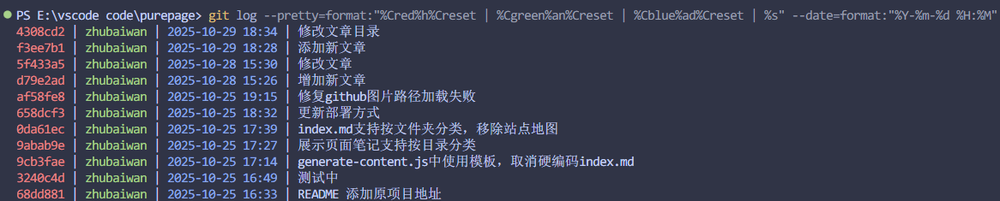

# 常用 git 命令

1. 把当前分支强行回退到 5f433a5 这个提交，并彻底清除回退过程中所有未提交的修改（危险）

```bash
git reset --hard 5f433a5
```


2. 强制将本地 main 分支的代码推送到远程 origin 仓库的 main 分支（危险）

```bash
git push -f origin main
```

3. 查看仓库提交历史记录（简洁显示）

```bash
git log --pretty=format:"%Cred%h%Creset | %Cgreen%an%Creset | %Cblue%ad%Creset | %s" --date=format:"%Y-%m-%d %H:%M"
```




4. 显示本地引用变动历史（所有操作轨迹）

```bash
git reflog
```

