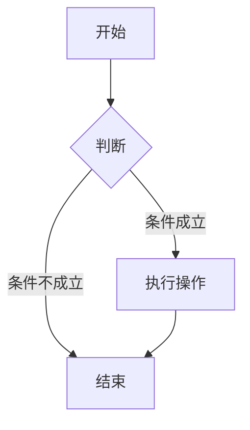
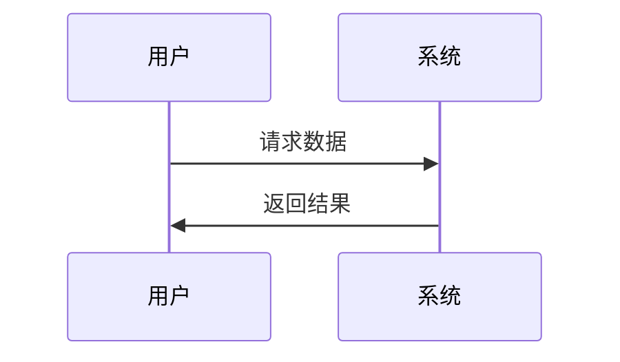
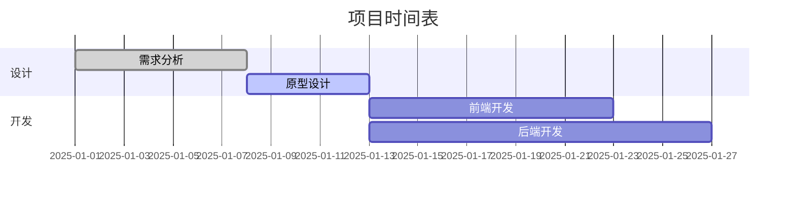

# 我的第一篇笔记

> 欢迎来到我的个人博客！这是我在这个博客上发布的第一篇文章，主要展示 PurePage 支持的 Markdown 语法。

## 关于这个博客

这个博客使用 PurePage 构建，是一个极简主义的静态博客系统。我喜欢它的简洁和高效，让我可以专注于写作本身。

## 📝 支持的Markdown语法

### 标题

```markdown
# 一级标题
## 二级标题
### 三级标题
#### 四级标题
```

### 文本格式

**粗体文本** 和 *斜体文本*

~~删除线文本~~

==高亮文本==

### 列表

#### 无序列表
- 列表项1
- 列表项2
  - 嵌套列表项
  - 嵌套列表项
- 列表项3

#### 有序列表
1. 第一项
2. 第二项
   1. 嵌套有序项
   2. 嵌套有序项
3. 第三项

#### 任务列表
- [x] 已完成任务
- [ ] 待完成任务
- [ ] 另一个任务

### 链接和图片

[链接到GitHub](https://github.com)


### 引用块

> 这是一个引用块
> 可以包含多行内容
> 
> > 嵌套引用

### 代码

#### 行内代码
使用 `print("Hello World")` 在文本中嵌入代码。

#### 代码块
```python
def fibonacci(n):
    """计算斐波那契数列"""
    if n <= 1:
        return n
    else:
        return fibonacci(n-1) + fibonacci(n-2)

# 使用示例
for i in range(10):
    print(f"F({i}) = {fibonacci(i)}")
```

```javascript
// JavaScript示例
function greet(name) {
    return `Hello, ${name}!`;
}

console.log(greet("World"));
```

### 表格

| 姓名 | 年龄 | 城市 |
|------|------|------|
| 张三 | 25   | 北京 |
| 李四 | 30   | 上海 |
| 王五 | 28   | 广州 |

### 数学公式

#### 行内公式
质能方程：$E = mc^2$

二次方程求根公式：$x = \frac{-b \pm \sqrt{b^2 - 4ac}}{2a}$

#### 块级公式
$$
\int_{-\infty}^{\infty} e^{-x^2} dx = \sqrt{\pi}
$$

$$
f(x) = \sum_{n=0}^{\infty} \frac{f^{(n)}(a)}{n!}(x-a)^n
$$

### Mermaid图表

#### 流程图


#### 时序图


#### 甘特图


### 脚注

这是一个带有脚注的文本[^1]。

[^1]: 这是脚注的内容。

### 分割线

---

## 🚀 博客使用指南

### 添加新文章
1. 在 `note/` 目录下创建 `.md` 文件
2. 使用上述 Markdown 语法编写内容
3. 运行生成脚本更新侧边栏和首页

### 更新脚本
```bash
node generate-sidebar-structure.js
```

### 部署流程
```bash
# 提交更改
git add .
git commit -m "添加新文章"

# 推送到 GitHub
git push origin main
```

GitHub Pages会自动部署，几分钟后即可访问新内容。

---

*感谢阅读！希望这个语法参考对您有帮助。*

**博客地址：** https://zhuBaiwan-oOZZXX.github.io/PurePage/