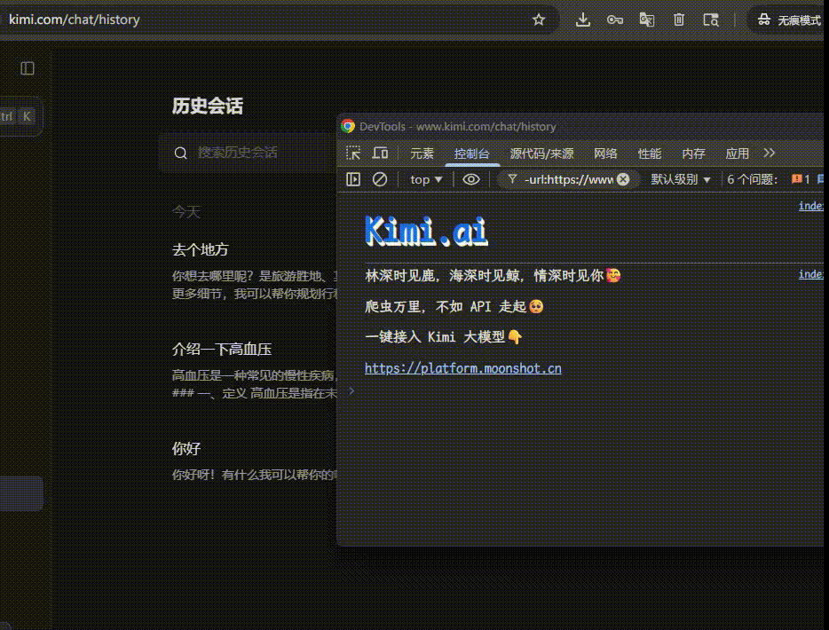

# 批量删除 kimi 网页对话

今天打开 kimi 发现有一堆历史垃圾对话，但 Kimi 网页上一直也没有批量删除的功能，只能一个一个选中删除。

要解决这件事也很简单，找到所有的复选框，点击一下就好了。

F12 打开控制台，输入以下代码：

```
$$('input:not(:checked)').map(i=>i.click())
```

1. `$$('input:not(:checked)')` – 浏览器控制台自带语法，等价于 `querySelectorAll`，挑出所有未勾选的 `<input>`。

2. `.map(i=>i.click())` – 对每个复选框执行一次点击打勾。

效果如下：

