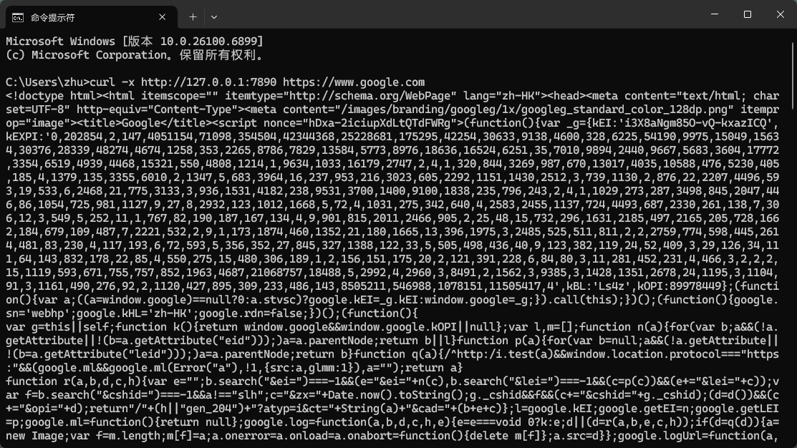
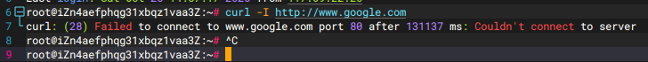
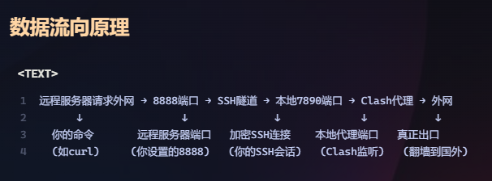
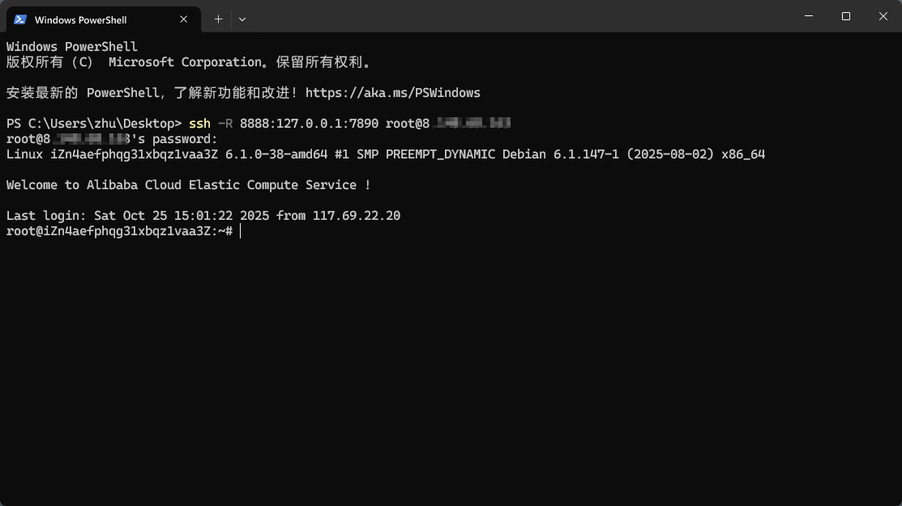
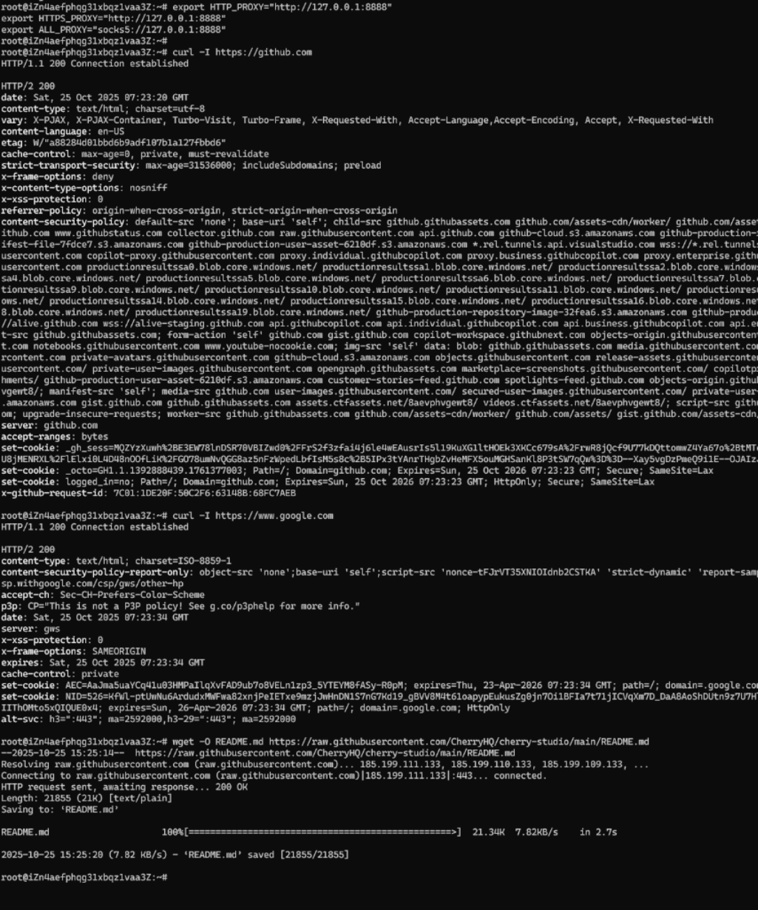

# 让远程服务器走本地电脑的代理实现科学上网

## 1. 开始前测试

### 本地运行 clash（不开 tun 模式）

在 cmd 测试，有返回表示成功：

```
curl -x http://127.0.0.1:7890 https://www.google.com
```



### 在服务器（国内服务器）上测试 google.com

结果当然是无法访问：



## 2. 让远程服务器走本地电脑的代理

> 数据流向：
> 
> 远程服务器请求外网 → 8888端口 → SSH隧道 → 本地7890端口 → Clash代理 → 外网



原理：登录到 ip 为 xx.xx.xx.xx 的服务器，并在服务器上开一个 8888 端口，所有发送到那个端口的数据，都通过 SSH 连接传回我本地电脑的 7890 端口处理

即命令：
```
ssh -R 8888:127.0.0.1:7890 用户@ip地址
```

然后输入你的密码进行登录




接着执行：

```
export HTTP_PROXY="http://127.0.0.1:8888"
export HTTPS_PROXY="http://127.0.0.1:8888"
export ALL_PROXY="socks5://127.0.0.1:8888"
```


即让服务器的程序把请求发给自己的 8888 端口，然后 8888 端口的数据通过 SSH 隧道传到自己的电脑上

现在测试就可以正常访问了：

